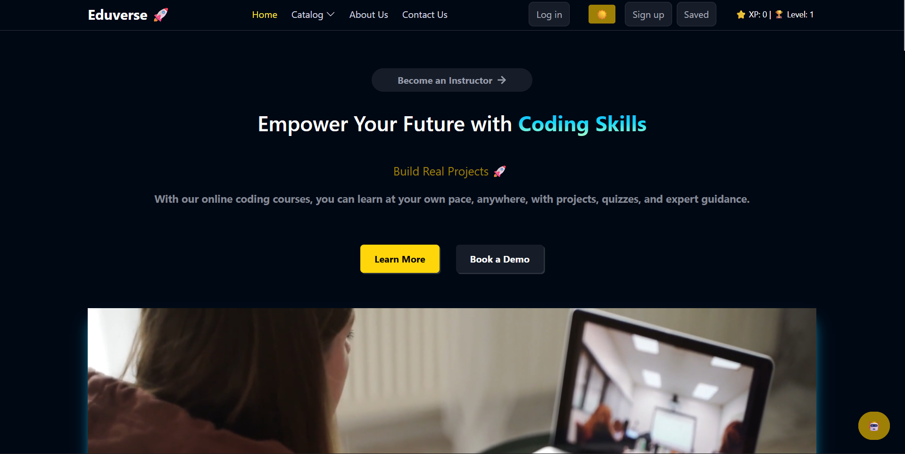
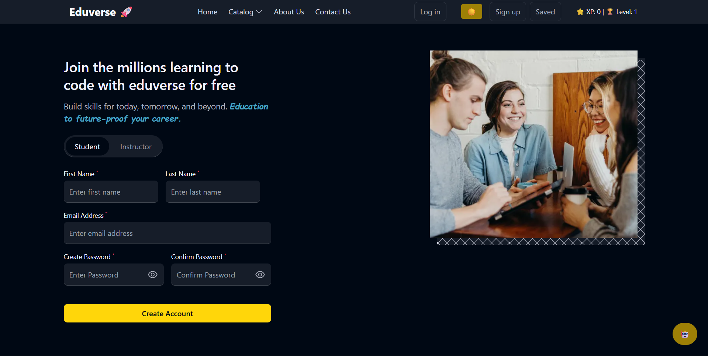
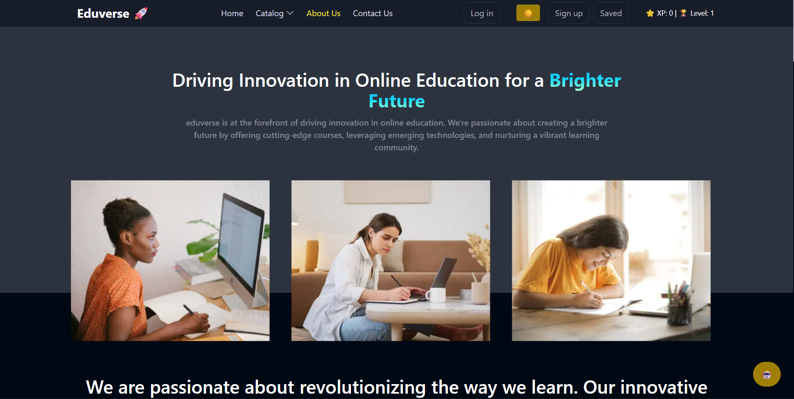

# 🚀 Eduverse – Full Stack Learning Platform

Eduverse is a modern full-stack e-learning platform that enables users to explore courses, track progress, and purchase premium content. It is built using the MERN stack with a clean UI and scalable backend.

---

## 🌐 Live Demo

* 🔗 Frontend: https://eduverse-nu-sage.vercel.app
* 🔗 Backend: https://eduverse-backend.onrender.com

---

## ✨ Features

* 👤 User Authentication (Login/Signup)
* 🎓 Browse & Enroll in Courses
* 📊 Dashboard for Students & Instructors
* 💳 Secure Payments (Razorpay Integration)
* 🧠 Course Creation & Management
* 🌙 Dark/Light Mode UI
* ⚡ Responsive & Fast UI
* 🤖 AI Assistant (Ollama)

---

## 🛠️ Tech Stack

**Frontend:**

* React.js
* Redux Toolkit
* Tailwind CSS

**Backend:**

* Node.js
* Express.js

**Database:**

* MongoDB Atlas

---

## 📸 Screenshots

### 🏠 Home Page



### 📊 Signup



### 📚 About us



---

## ⚙️ Installation & Setup

### 1️⃣ Clone the repository

```bash
git clone https://github.com/Abhishek2106-ai/Eduverse.git
cd Eduverse
```

### 2️⃣ Install dependencies

```bash
npm install
cd server && npm install
```

### 3️⃣ Setup Environment Variables

Create `.env` in server:

```env
MONGO_URI=your_mongodb_url
JWT_SECRET=your_secret
RAZORPAY_KEY=your_key
RAZORPAY_SECRET=your_secret
```

---

### 4️⃣ Run project

```bash
# backend
cd server
npm start

# frontend
cd ..
npm start
```

---

## 📁 Project Structure

```bash
Eduverse/
 ├── src/        # Frontend
 ├── server/     # Backend
 ├── screenshots/
 ├── package.json
 └── README.md
```

---

## 🚀 Future Improvements

* 🔔 Notifications system
* 🤖 AI-based course recommendations
* 📱 Mobile responsiveness enhancements

---

## 👨‍💻 Author

**Abhishek Singh**

---

## ⭐ Support

If you like this project, give it a ⭐ on GitHub!
